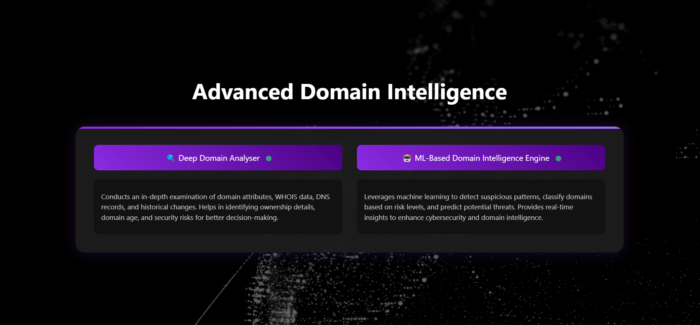
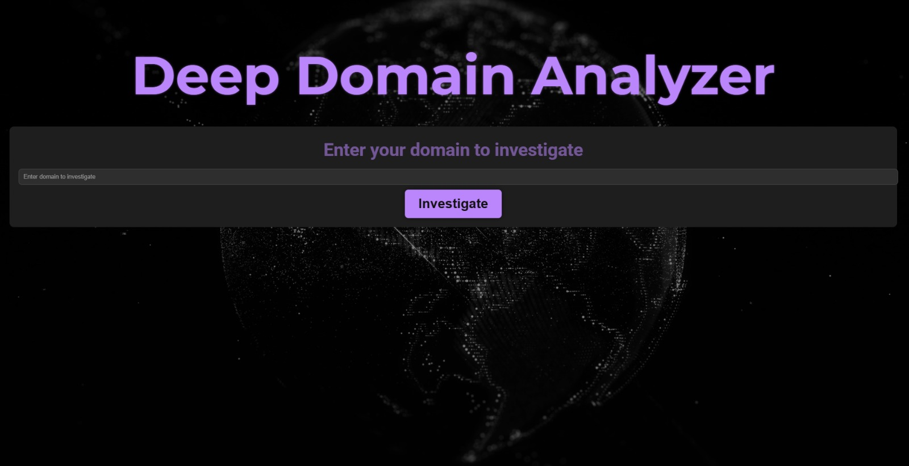
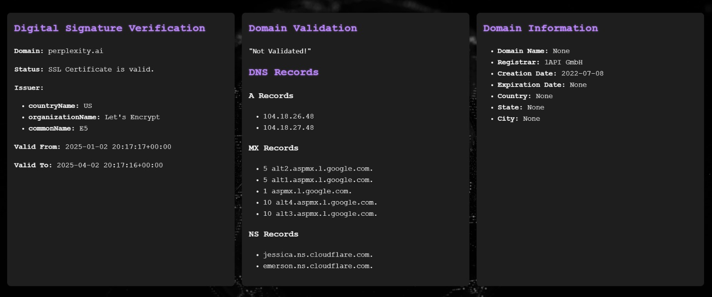
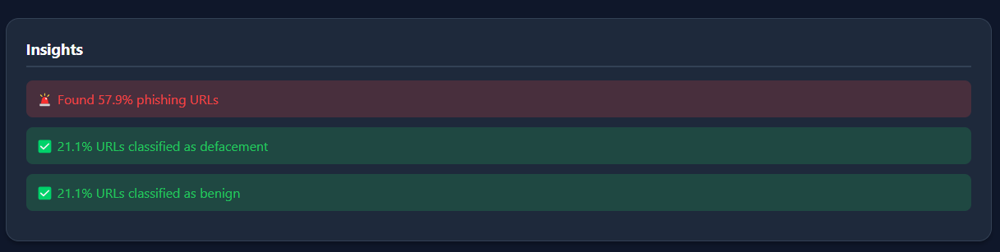
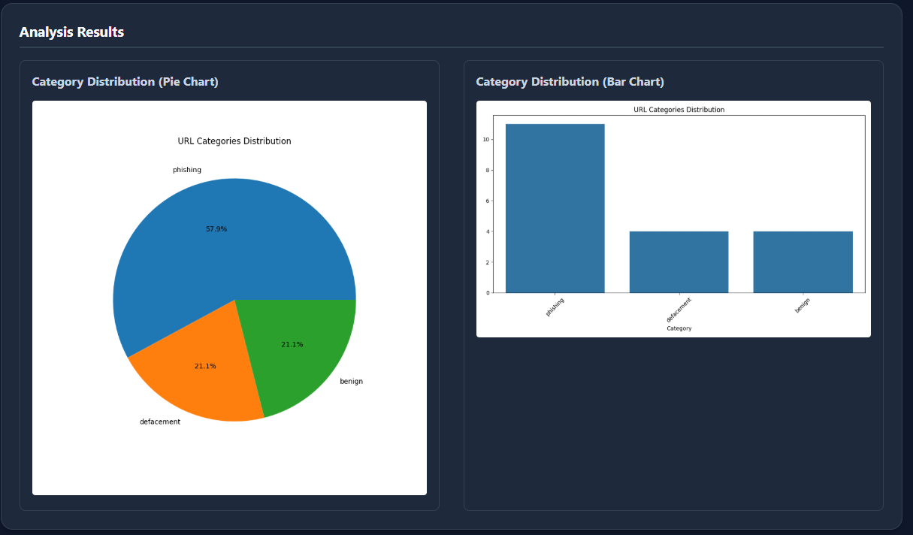

# Advanced Domain Intelligence Suite
<p align="center">
  
</p>
The Advanced Domain Intelligence Suite is a powerful toolkit designed to provide comprehensive domain analysis, threat detection, and actionable insights. It combines deep analytics, machine learning, and real-time intelligence to uncover domain patterns, detect anomalies, and assess risk levels. This suite is ideal for cybersecurity professionals, brand managers, and domain administrators.

## Features

### 🚀 Advanced Domain Intelligence
- Combines deep analytics and machine learning to uncover domain patterns
- Detects anomalies and assesses risk levels
- Integrates WHOIS data, DNS records, historical trends, and AI-driven threat detection
- Provides actionable insights for cybersecurity, brand protection, and domain reputation management

### 🔍 Deep Domain Analyser
- Conducts in-depth examination of domain attributes, WHOIS data, DNS records, and historical changes
- Identifies ownership details, domain age, and security risks
- Helps in making informed decisions about domain usage and security

### 🤖 ML-Based Domain Intelligence Engine
- Leverages machine learning to detect suspicious patterns and classify domains based on risk levels
- Predicts potential threats and provides real-time insights
- Enhances cybersecurity and domain intelligence

## Project Structure
```
domain_intelligence_suite/
├── advanced_domain_intelligence/    # Main launcher app (port 5002)
│   ├── app.py
│   └── templates/
│       └── index.html
│
├── deep_domain_analyser/           # First tool (port 5000)
│   ├── app.py
│   ├── templates/
│   │   └── index.html
│   └── static/
│       └── css/
│           └── style.css
│
└── ml_domain_intelligence/         # Second tool (port 5001)
    ├── app.py
    ├── templates/
    │   └── index.html
    └── static/
        └── css/
            └── style.css
```

## Tools Overview
## Built With


### Programming Languages:

* [![Python][Python]][Python-url] – Backend processing and API integrations
* [![JavaScript][JavaScript]][JavaScript-url] – Frontend interactivity and API calls
* [![HTML5][HTML5]][HTML5-url] – UI design and styling
* [![CSS3][CSS3]][CSS3-url] – UI design and styling


### Frameworks & Libraries:

* [![Flask][Flask]][Flask-url] – For building a web-based application
* [![Sublist3r][Sublist3r]][Sublist3r-url] – For subdomain enumeration


### APIs & Tools:

* [![IPinfo][IPinfo]][IPinfo-url] – For gathering IP address information
* [![VirusTotal][VirusTotal]][VirusTotal-url] – For gathering security threat intelligence


### Programming Languages:

* [![Python][Python]][Python-url] – Backend processing and API integrations
* [![JavaScript][JavaScript]][JavaScript-url] – Frontend interactivity and API calls
* [![HTML5][HTML5]][HTML5-url] – UI design and styling
* [![CSS3][CSS3]][CSS3-url] – UI design and styling


### Frameworks & Libraries:

* [![Flask][Flask]][Flask-url] – For building a web-based application
* [![Sublist3r][Sublist3r]][Sublist3r-url] – For subdomain enumeration


### APIs & Tools:

* [![IPinfo][IPinfo]][IPinfo-url] – For gathering IP address information
* [![VirusTotal][VirusTotal]][VirusTotal-url] – For gathering security threat intelligence

### 1. Deep Domain Analyser (Port 5000)

<p align="center">
  
</p>
**Description**: A Flask-based application for conducting deep domain analysis.

**Features**:
- WHOIS data lookup
- DNS record analysis
- Historical domain changes
- Security risk assessment

<p align="center">
  
</p>

- Malicious Website Detection: Analyzes DNS, network behavior, and website patterns for threats. 
- DNS Resolution: Maps domains to IPs, revealing hosting details. 
- VirusTotal Integration: Cross-checks domains with malicious databases. 
- Geolocation & Metadata: Extracts IP, ASN, and ISP info for context. 
- Subdomain Discovery: Identifies subdomains and origin servers. 
- IP Range Comparison: Detects origin servers behind CDNs. 
- WHOIS & Certificate Analysis: Retrieves domain registration and SSL/TLS data.

**How to Run**:
```bash
cd deep_domain_analyser
python app.py
```
Access the app at http://localhost:5000

### 2. ML-Based Domain Intelligence (Port 5001)
**Description**: A Flask-based application leveraging machine learning for domain threat detection and classification.
<p align="center">
  
</p>
The risk analysis dashboard provides comprehensive insights into domain threats:

- Risk Score: Overall domain safety rating from 0-100
- Maliciousness Probability: ML-driven prediction of malicious intent

Domain Intelligence Analytics
<p align="center">
  
</p>
The analytics dashboard visualizes key domain metrics:

- Threat Trends: Historical view of domain risk levels
- Category Distribution: Domain purpose classification
- Related Domain Network: Connected domain ecosystem visualization
**Features**:
- Suspicious pattern detection
- Risk level classification
- Real-time threat insights

**How to Run**:
```bash
cd ml_domain_intelligence
python app.py
```
Access the app at http://localhost:5001

### 3. Advanced Domain Intelligence (Port 5002)
**Description**: The main launcher app that integrates both tools and provides a unified interface for domain intelligence.

**Features**:
- Unified dashboard for domain analysis
- Integration of WHOIS, DNS, and historical data
- AI-driven threat detection and risk assessment

**How to Run**:
```bash
cd advanced_domain_intelligence
python app.py
```
Access the app at http://localhost:5002

## Installation

1. Clone the repository:
```bash
git clone https://github.com/yourusername/domain_intelligence_suite.git
cd domain_intelligence_suite
```

2. Install dependencies:
```bash
pip install -r requirements.txt
```

3. Run the desired tool:

For Deep Domain Analyser:
```bash
cd deep_domain_analyser
python app.py
```

For ML-Based Domain Intelligence:
```bash
cd ml_domain_intelligence
python app.py
```

For Advanced Domain Intelligence:
```bash
cd advanced_domain_intelligence
python app.py
```

## Usage

1. Open your browser and navigate to the respective port:
   - Deep Domain Analyser: http://localhost:5000
   - ML-Based Domain Intelligence: http://localhost:5001
   - Advanced Domain Intelligence: http://localhost:5002

2. Enter the domain name you want to analyze in the input field.

3. View the detailed analysis, risk assessment, and actionable insights.

## Contributing

Contributions are welcome! Please follow these steps:

1. Fork the repository
2. Create a new branch (`git checkout -b feature/YourFeatureName`)
3. Commit your changes (`git commit -m 'Add some feature'`)
4. Push to the branch (`git push origin feature/YourFeatureName`)
5. Open a pull request

## License

This project is licensed under the MIT License. See the LICENSE file for details.

## Authors

* Niyati Patel
* Suhani Patel
* Nishant Kumar


## License

This project is licensed under the [NAME HERE] License - see the LICENSE.md file for details

## Acknowledgments

Inspiration, code snippets, etc.

[Python]: https://img.shields.io/badge/Python-3776AB?style=flat&logo=python&logoColor=white
[Python-url]: https://www.python.org/

[JavaScript]: https://img.shields.io/badge/JavaScript-F7DF1E?style=flat&logo=javascript&logoColor=black
[JavaScript-url]: https://developer.mozilla.org/en-US/docs/Web/JavaScript

[HTML5]: https://img.shields.io/badge/HTML5-E34F26?style=flat&logo=html5&logoColor=white
[HTML5-url]: https://developer.mozilla.org/en-US/docs/Web/HTML

[CSS3]: https://img.shields.io/badge/CSS3-1572B6?style=flat&logo=css3&logoColor=white
[CSS3-url]: https://developer.mozilla.org/en-US/docs/Web/CSS

[Flask]: https://img.shields.io/badge/Flask-000000?style=flat&logo=flask&logoColor=white
[Flask-url]: https://flask.palletsprojects.com/

[Sublist3r]: https://img.shields.io/badge/Sublist3r-FF6F00?style=flat&logo=python&logoColor=white
[Sublist3r-url]: https://github.com/aboul3la/Sublist3r

[IPinfo]: https://img.shields.io/badge/IPinfo-000000?style=flat&logo=ipinfo&logoColor=white
[IPinfo-url]: https://ipinfo.io/

[VirusTotal]: https://img.shields.io/badge/VirusTotal-FF6F00?style=flat&logo=virustotal&logoColor=white
[VirusTotal-url]: https://www.virustotal.com/